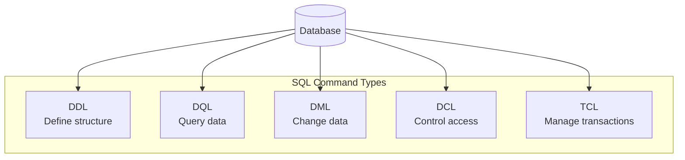
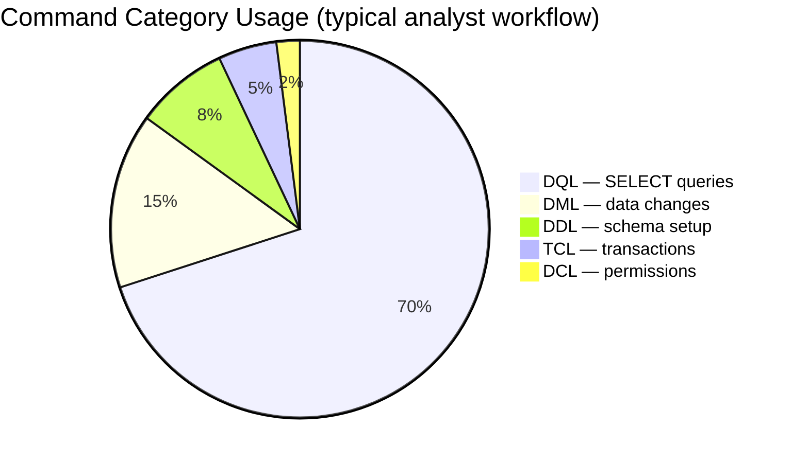
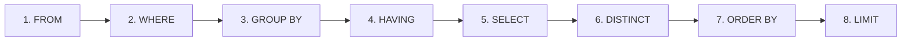
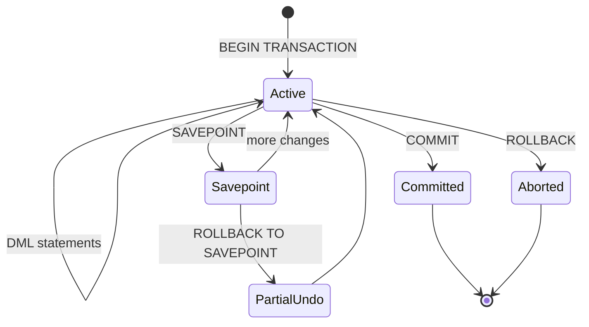
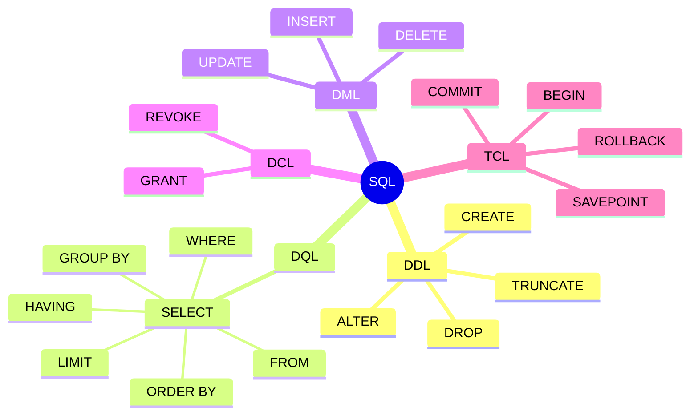

# SQL Commands Reference — DDL, DQL, DML, DCL & TCL

**Topic 7 · Week 7 · Module 2: SQL & Databases**

SQL commands are the building blocks for working with relational databases. They let you define structure, query data, change records, control access, and manage transactions.

---

## Core Concepts

| Term | Definition |
|------|------------|
| **Database** | A collection of organized, related data |
| **Table** | Data stored in rows and columns |
| **Row (Record)** | One entry in a table |
| **Column (Field)** | One attribute of the data |
| **Primary Key** | Uniquely identifies each row |
| **Query** | A request to read or modify data |
| **Constraint** | A rule that keeps data valid |

### Sample Table: `employees`

| employee_id | name | department | salary | manager_id | hire_date |
|:-----------:|------|------------|-------:|:----------:|-----------|
| 1 | Raj Kapoor | Sales | 75,000 | — | 2019-03-01 |
| 2 | Nisha Gupta | Sales | 55,000 | 1 | 2020-06-15 |
| 3 | Amit Sharma | Sales | 60,000 | 1 | 2021-01-10 |
| 4 | Pooja Iyer | Marketing | 70,000 | — | 2018-11-20 |
| 6 | Deepa Nair | Engineering | 90,000 | — | 2017-04-22 |

> Run queries against this table using `sample_database_setup.sql` in the parent folder.

---

## SQL Command Categories

SQL commands fall into **five categories**, each with a distinct role:



| Category | Full Name | Purpose | Common Commands |
|----------|-----------|---------|-----------------|
| **DDL** | Data Definition Language | Create, alter, or drop database objects | `CREATE`, `ALTER`, `DROP`, `TRUNCATE` |
| **DQL** | Data Query Language | Read data from tables | `SELECT` (+ clauses) |
| **DML** | Data Manipulation Language | Insert, update, or delete rows | `INSERT`, `UPDATE`, `DELETE` |
| **DCL** | Data Control Language | Grant or revoke user permissions | `GRANT`, `REVOKE` |
| **TCL** | Transaction Control Language | Group changes into atomic units | `BEGIN`, `COMMIT`, `ROLLBACK`, `SAVEPOINT` |



---

## 1. DDL — Data Definition Language

DDL defines and modifies the **structure** of database objects (tables, indexes, views). It does not query row data.

| Command | Description | Syntax |
|---------|-------------|--------|
| **CREATE** | Create a database or object | `CREATE TABLE table_name (col1 TYPE, col2 TYPE, ...);` |
| **DROP** | Permanently remove an object | `DROP TABLE table_name;` |
| **ALTER** | Change an existing structure | `ALTER TABLE table_name ADD COLUMN col TYPE;` |
| **TRUNCATE** | Remove all rows (keeps table structure) | `TRUNCATE TABLE table_name;` |
| **COMMENT** | Add metadata to the data dictionary | `COMMENT ON TABLE t IS 'description';` |
| **RENAME** | Rename an object | `RENAME TABLE old_name TO new_name;` |

**Example — create a table:**

```sql
CREATE TABLE employees (
    employee_id INT PRIMARY KEY,
    first_name  VARCHAR(50),
    last_name   VARCHAR(50),
    hire_date   DATE
);
```

| Before | After `CREATE TABLE` |
|--------|----------------------|
| Table does not exist | Empty table with defined columns, ready for `INSERT` |

---

## 2. DQL — Data Query Language

DQL retrieves data. The only DQL **command** is `SELECT`. Terms like `FROM`, `WHERE`, and `ORDER BY` are **clauses** of `SELECT`, not separate commands.

### SELECT Clauses

| Clause | Role | Syntax |
|--------|------|--------|
| **SELECT** | Choose columns to return | `SELECT col1, col2, ...` |
| **FROM** | Specify source table(s) | `FROM table_name` |
| **WHERE** | Filter rows before grouping | `WHERE condition` |
| **GROUP BY** | Group rows with the same values | `GROUP BY col1` |
| **HAVING** | Filter grouped results | `HAVING condition` |
| **DISTINCT** | Remove duplicate rows | `SELECT DISTINCT col1, col2` |
| **ORDER BY** | Sort the result set | `ORDER BY col1 [ASC \| DESC]` |
| **LIMIT** | Cap rows returned (MySQL / PostgreSQL) | `LIMIT number` |

### Query Execution Order

You **write** clauses in one order, but SQL **executes** them in another:



| Write Order | Execute Order |
|-------------|---------------|
| `SELECT` → `FROM` → `WHERE` → `GROUP BY` → `HAVING` → `ORDER BY` → `LIMIT` | `FROM` → `WHERE` → `GROUP BY` → `HAVING` → `SELECT` → `DISTINCT` → `ORDER BY` → `LIMIT` |

**Example — filter and sort:**

```sql
SELECT first_name, last_name, hire_date
FROM employees
WHERE department = 'Sales'
ORDER BY hire_date DESC;
```

**Result:**

| first_name | last_name | hire_date |
|------------|-----------|-----------|
| Amit | Sharma | 2021-01-10 |
| Nisha | Gupta | 2020-06-15 |
| Raj | Kapoor | 2019-03-01 |

### Before & After: `WHERE` + `ORDER BY`

**All Sales employees (unsorted):**

| name | department | salary |
|------|------------|-------:|
| Raj Kapoor | Sales | 75,000 |
| Nisha Gupta | Sales | 55,000 |
| Amit Sharma | Sales | 60,000 |

**After `ORDER BY salary DESC`:**

| name | department | salary |
|------|------------|-------:|
| Raj Kapoor | Sales | 75,000 |
| Amit Sharma | Sales | 60,000 |
| Nisha Gupta | Sales | 55,000 |

---

## 3. DML — Data Manipulation Language

DML changes the **data inside** tables — adding, updating, or removing rows.

| Command | Description | Syntax |
|---------|-------------|--------|
| **INSERT** | Add new rows | `INSERT INTO t (col1, col2) VALUES (v1, v2);` |
| **UPDATE** | Modify existing rows | `UPDATE t SET col1 = v1 WHERE condition;` |
| **DELETE** | Remove rows | `DELETE FROM t WHERE condition;` |

**Example — insert a row:**

```sql
INSERT INTO employees (first_name, last_name, department)
VALUES ('Jane', 'Smith', 'HR');
```

| Before (3 rows in HR context) | After INSERT |
|---------------------------------|--------------|
| 10 employees total | 11 employees — new row appended |

**Example — update rows:**

```sql
UPDATE employees
SET department = 'Marketing'
WHERE department = 'Sales';
```

| employee_id | department (before) | department (after) |
|:-----------:|---------------------|--------------------|
| 1 | Sales | Marketing |
| 2 | Sales | Marketing |
| 3 | Sales | Marketing |

---

## 4. DCL — Data Control Language

DCL manages **who can access what** in the database.

| Command | Description | Syntax |
|---------|-------------|--------|
| **GRANT** | Give privileges to a user | `GRANT privilege ON object TO user;` |
| **REVOKE** | Remove privileges from a user | `REVOKE privilege ON object FROM user;` |

**Example:**

```sql
GRANT SELECT, UPDATE ON employees TO analyst_user;
```

| User | Before | After GRANT |
|------|--------|-------------|
| `analyst_user` | No access to `employees` | Can `SELECT` and `UPDATE` |

---

## 5. TCL — Transaction Control Language

A **transaction** groups multiple SQL statements into one unit: either **all succeed** or **all are undone**.

| Command | Description | Syntax |
|---------|-------------|--------|
| **BEGIN TRANSACTION** | Start a transaction | `BEGIN TRANSACTION;` |
| **COMMIT** | Save all changes permanently | `COMMIT;` |
| **ROLLBACK** | Undo all changes in the transaction | `ROLLBACK;` |
| **SAVEPOINT** | Mark a point to roll back to | `SAVEPOINT name;` |



**Example — transaction with savepoint:**

```sql
BEGIN TRANSACTION;
UPDATE employees SET department = 'Marketing' WHERE department = 'Sales';
SAVEPOINT before_hr_update;
UPDATE employees SET department = 'IT'       WHERE department = 'HR';
ROLLBACK TO SAVEPOINT before_hr_update;  -- undoes HR → IT only
COMMIT;                                  -- keeps Sales → Marketing
```

| Step | Sales dept | HR dept |
|------|------------|---------|
| Start | 3 employees | 2 employees |
| After 1st UPDATE | 0 (moved to Marketing) | 2 employees |
| After 2nd UPDATE | 0 | 0 (moved to IT) |
| After ROLLBACK TO SAVEPOINT | 0 | 2 (restored) |
| After COMMIT | 0 (Marketing change kept) | 2 employees |

---

## Quick Comparison Chart

| | DDL | DQL | DML | DCL | TCL |
|---|:---:|:---:|:---:|:---:|:---:|
| Changes table structure | ✓ | — | — | — | — |
| Reads row data | — | ✓ | — | — | — |
| Changes row data | — | — | ✓ | — | ✓ |
| Manages permissions | — | — | — | ✓ | — |
| Can be rolled back* | — | — | ✓ | — | ✓ |
| Auto-commits in most DBs | ✓ | — | — | ✓ | — |

\* DDL rollback behavior varies by database (PostgreSQL supports transactional DDL; MySQL traditionally auto-commits DDL).

---

## Category → Command Map



---

## Related Files in This Module

| File | Purpose |
|------|---------|
| `07_SQL_Basics_Notes_and_Queries.sql` | Annotated notes + runnable examples for SELECT, WHERE, DISTINCT, ORDER BY, LIMIT |
| `07_Practice_Query_Library.sql` | Solutions to Week 7 practice exercises |
| `../sample_database_setup.sql` | Sample tables (`customers`, `products`, `orders`, `employees`, …) |
| `README.md` | Week 7 learning objectives and daily practice plan |

---

## References

- [SQLZoo — SELECT Basics](https://sqlzoo.net/wiki/SELECT_basics)
- [Mode SQL Tutorial — Basic SELECT](https://mode.com/sql-tutorial/sql-select-statement/)
- [PostgreSQL SELECT Documentation](https://www.postgresql.org/docs/current/sql-select.html)
